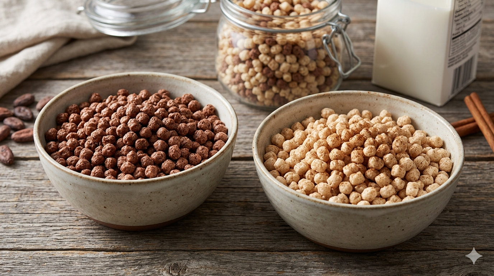

# ANDEAN CEREAL MIX (QUINOA, CHOCOLATE & CINNAMON)

## 1. Descripción
Mezcla nutritiva basada en quinua con chocolate y canela.

## 2. Tipo de alimento
Cereal funcional

## 3. Ingredientes
Quinua, cacao, canela, azúcar

## 4. Presentación
- 250g – 500g

## 5. Vida útil
12 meses

## 6. Almacenamiento
Lugar seco

## 7. Beneficios
- Alto contenido energético  
- Fuente de proteína  
- Ideal para desayuno  

## 8. Información nutricional (por 100g)
- Energía: 380 kcal  
- Proteína: 12g  
- Carbohidratos: 70g  

## 9. Aplicaciones
- Desayuno  
- Snacks  

## 10. Origen
Ecuador

## 11. Marca
INTI SOMOS
