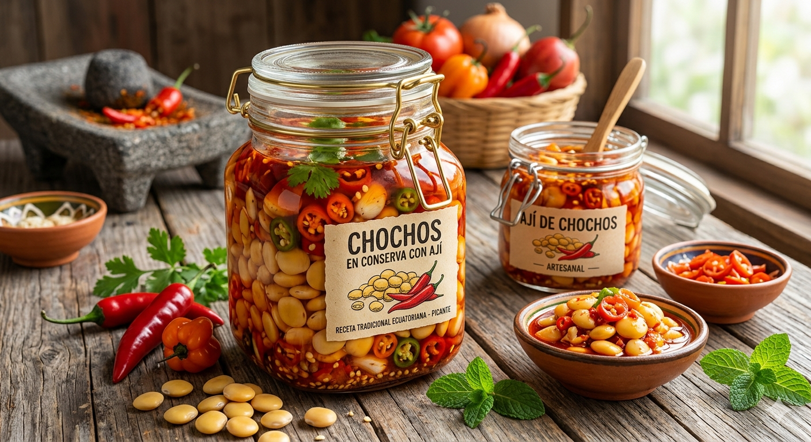

# LUPIN BEANS IN CHILI SAUCE / CHOCHOS EN AJÍ

## 1. Descripción
Producto tradicional listo para consumo con ají.

## 2. Tipo de alimento
Conserva

## 3. Ingredientes
Chochos, ají, agua, sal

## 4. Presentación
- Frascos 200g – 500g

## 5. Vida útil
12 meses

## 6. Almacenamiento
Refrigerar después de abrir

## 7. Beneficios
- Listo para consumo  
- Sabor auténtico  
- Rico en proteína  

## 8. Información nutricional (por 100g)
- Energía: 200 kcal  
- Proteína: 15g  
- Carbohidratos: 10g  

## 9. Aplicaciones
- Acompañamientos  
- Food service  

## 10. Origen
Ecuador

## 11. Marca
INTI SOMOS
